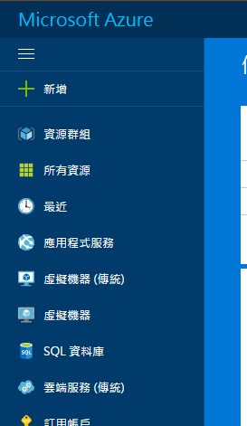
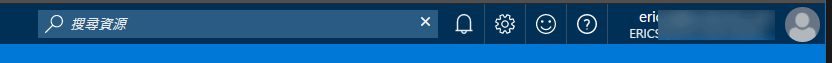
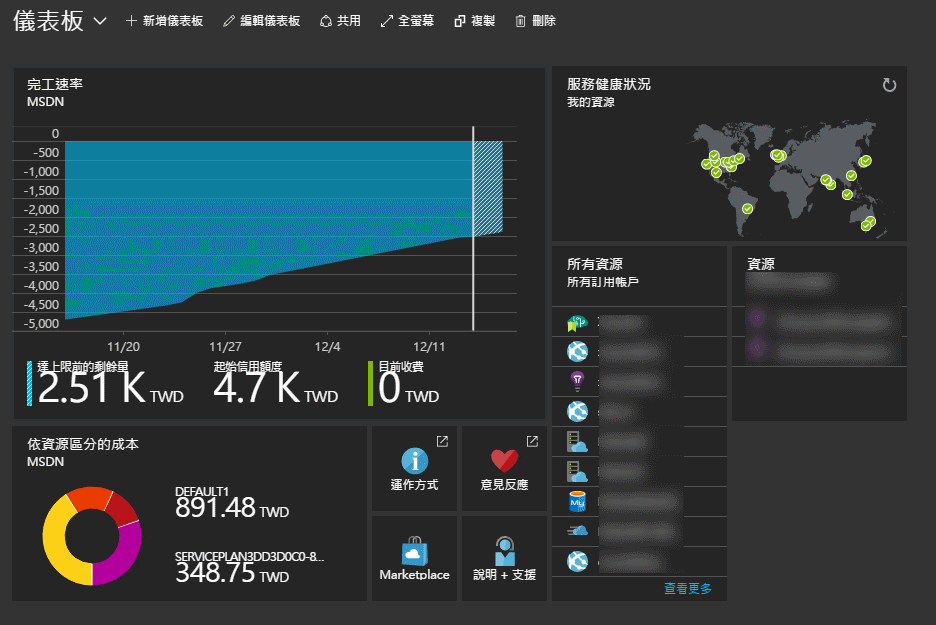
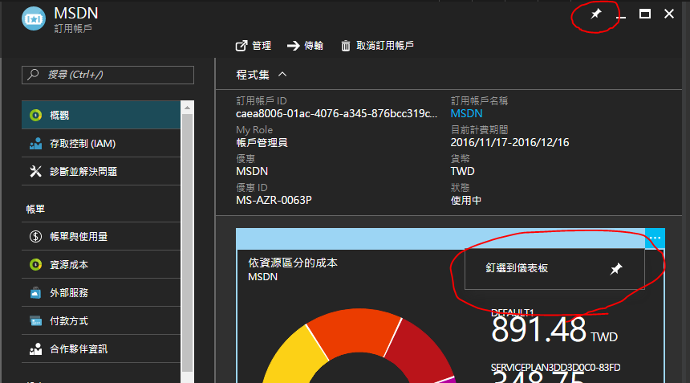
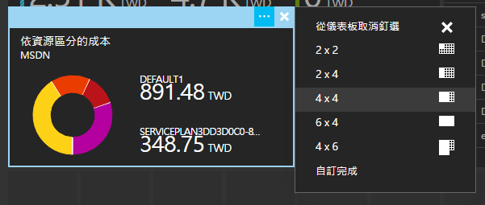

# Azure 管理後台 (Portal)

擁有 Azure 訂用帳戶（subscription）後，你就會在 Azure 管理後台裡操作建置或管理服務，當然幾乎所有的動作都可以透過 Azure 的命令列工具（有 PowerShell 版本以及跨平台的版本）來完成，不過這個部份我們在之後的節目中再做介紹。

## 基本操作

登入[管理後台](https://portal.azure.com/)之後，左側的工具列主要是新增或檢視各項服務，包含檢視訂用帳戶的部份：

_左側面板可以收起來喔_

畫面右上方則是包含了：

  * 搜尋資源: 直接搜尋已經建立的 Azure 服務。
  * 通知: 在 Azure 上做了任何的部署動作、或是系統通知訊息都會在這裡顯示。
  * 設定: 可以設定動畫效果、佈景主題、語言地區格式等等。
  * 傳送意見回饋: Azure 管理後台的產品研發團隊很希望直接聽到用戶的意見，所以如果你有任何建議或是遇到 bug 都可以利用這裡反應。
  * 請求支援: 如果你在 Azure 上遇到技術或帳務的問題，可以從這裡發出請求支援的要求，微軟的技術支援團隊會與你聯絡。
  * 帳號操作: 登出、改密碼、查看帳單、切換共用的訂用帳戶等等操作。

其餘的主要畫面是一個你可以自訂呈現內容的的儀表板（dashboard），將您最關心的資訊部份呈現在儀表板上。另一方面，你也可以建立多個不同的儀表板來做呈現。

## 釘選或調整大小

由於目前 Azure 管理後台的資訊面板（稱作 blade）的設計，每當要更深入檢視或設定詳細內容時，就會繼續在右側長出新的面板，所以如果經常檢視某個面板畫面時，可以直接把它釘選到儀表板上，通常會在該面板的右上角或是選單中會有個**圖釘**的圖案，就可以直接釘選到儀表板。

而釘到儀表板的內容，也可以選擇各種大小，方便你編排最舒適的版面。

## Exercise

  * 是否會設定管理後台的佈景主題?
  * 釘選自訂自己關注的資訊面板
  * 建立一個以上的儀表板