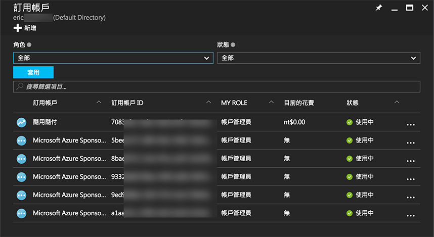
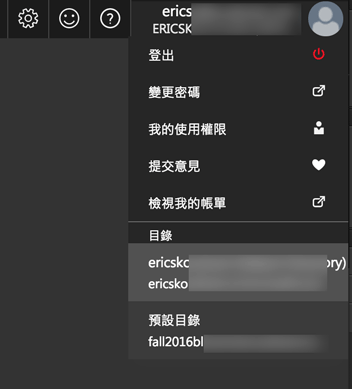

# Microsoft Azure 訂用帳戶（subscription）概觀

## 簡介
在 Microsoft Azure 裡，一個 [Microsoft 帳號](https://www.microsoft.com/zh-tw/account)（也就是你之前會稱之為 Live ID、MSN 帳號、Skype 帳號、XBox Live 帳號等等）下可以建立多個**訂用帳戶**（_subscription_，或是翻作「訂閱」），每個訂閱彼此是相互獨立的，同時有單獨的帳單以及付費方式。在 Microsoft Azure 上建立任何一個服務都會讓你選擇要建立在哪個訂用帳戶之下，決定要把費用計算在哪裡。

_圖: 一個帳號下多個訂用帳戶_

## 訂用帳戶種類

常見的 Azure 訂用帳戶有幾種類型：

  * 隨付即用 (Pay-as-you-Go) 的免費試用或正式帳戶
  * 各種微軟計劃（如：MSDN 訂閱用戶、Imagine Access 等）的 Azure 優惠訂閱
  * 用於活動或教學的 Azure Pass 訂閱
  * Azure In Open 訂閱
  * Enterprise Agreement (EA) 訂閱
  * ...

如果要確定你擁有的訂用帳戶是哪種類型，可以在 Azure 管理界面中查詢，同時也可以確定該在哪裡查看帳單或付費方式等。

  > Azure In Open、EA 訂用帳戶的細節可以請教經銷商或是微軟的業務人員。

### 常見問題

  * 訂閱間各自獨立，若要搬動服務請尋求支援服務處理。
  * 訂閱可以設定共同管理員，擁有共同管理權限的帳號除了可以在管理界面上切換操作之外，與 Azure 整合的工具或服務也可以直接選擇。

    

### Exercise

  * 確定你擁有的 Microsoft Azure 訂閱是哪種類型、如何付費
  * 若無，可以從[這裡](https://azure.microsoft.com/zh-tw/free/)開始免費建立一個
  * 設定共同管理員